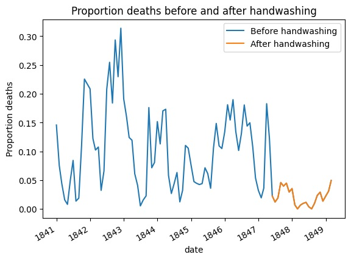

[![LinkedIn][linkedin-shield]][linkedin-url]

# Dr. Semmelweis and the Discovery of Handwashing

In this project, we will reanalyze the data that made Semmelweis discover the importance of handwashing. Let's start by looking at the data that made Semmelweis realize that something was wrong with the procedures at Vienna General Hospital.

## Meet Dr. Ignaz Semmelweis

<!--

-->

This is Dr. Ignaz Semmelweis, a Hungarian physician born in 1818 and active at the Vienna General Hospital. If Dr. Semmelweis looks troubled it's probably because he's thinking about <em>childbed fever</em>: A deadly disease affecting women that just have given birth. He is thinking about it because in the early 1840s at the Vienna General Hospital as many as 10% of the women giving birth die from it. He is thinking about it because he knows the cause of childbed fever: It's the contaminated hands of the doctors delivering the babies. And they won't listen to him and <em>wash their hands</em>!

In this notebook, we're going to reanalyze the data that made Semmelweis discover the importance of <em>handwashing</em>. Let's start by looking at the data that made Semmelweis realize that something was wrong with the procedures at Vienna General Hospital.

## The effect of handwashing highlighted

Starting from the summer of 1847 the proportion of deaths is drastically reduced when Semmelweis made handwashing obligatory. 

The effect of handwashing is made clear if we highlight this in the graph.

[linkedin-shield]: https://img.shields.io/badge/-LinkedIn-blue.svg?style=for-the-badge
[linkedin-url]: https://linkedin.com/in/victorfa
